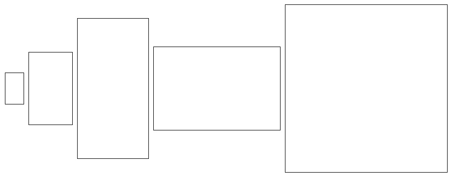
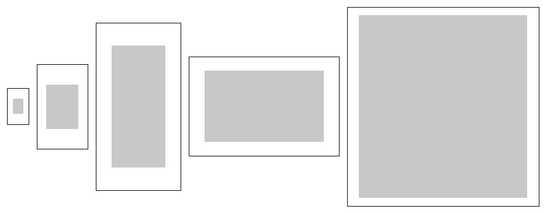
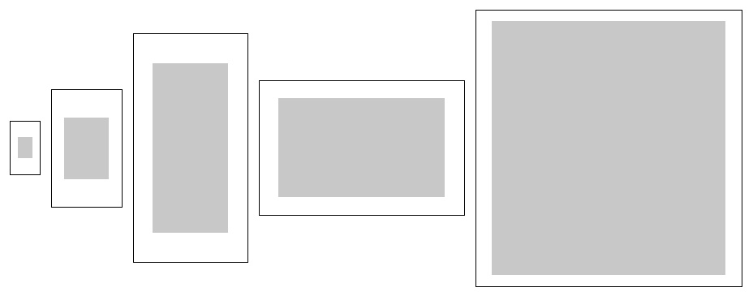

  Language:
    🇺🇸
  <a title="Chinese" href="./README.zh-CN.md">🇨🇳</a>

  «anchor-boxes» generated the anchor-boxes required for training YOLO networks
 
 
  
  
  

* For Darknet implemetation, see [darknet](darknet)
  

* For custom YOLOv2 anchor-boxes implementation, see [v2](v2)
  

* For custom YOLOv3 anchor-boxes implementation, see [v3](v3)
  

* ***Blank boxes represent anchors based on VOC***
* ***Grayscale boxes represent anchors based on COCO***

## Table of Contents

- [Table of Contents](#table-of-contents)
- [Background](#background)
- [Maintainers](#maintainers)
- [Thanks](#thanks)
- [Contributing](#contributing)
- [License](#license)

## Background

This repository implements different ways of generating code for anchor-boxes, including YOLOv2/YOLOv3 anchor-box generation, using PASCAL VOC and COCO datasets

## Maintainers

* zhujian - *Initial work* - [zjykzj](https://github.com/zjykzj)

## Thanks

* [AlexeyAB/darknet](https://github.com/AlexeyAB/darknet/tree/master)
* [lars76/kmeans-anchor-boxes](https://github.com/lars76/kmeans-anchor-boxes)

## Contributing

Anyone's participation is welcome! Open an [issue](https://github.com/zjykzj/anchor-boxes/issues) or submit PRs.

Small note:

* Git submission specifications should be complied
  with [Conventional Commits](https://www.conventionalcommits.org/en/v1.0.0-beta.4/)
* If versioned, please conform to the [Semantic Versioning 2.0.0](https://semver.org) specification
* If editing the README, please conform to the [standard-readme](https://github.com/RichardLitt/standard-readme)
  specification.

## License

[Apache License 2.0](LICENSE) © 2023 zjykzj